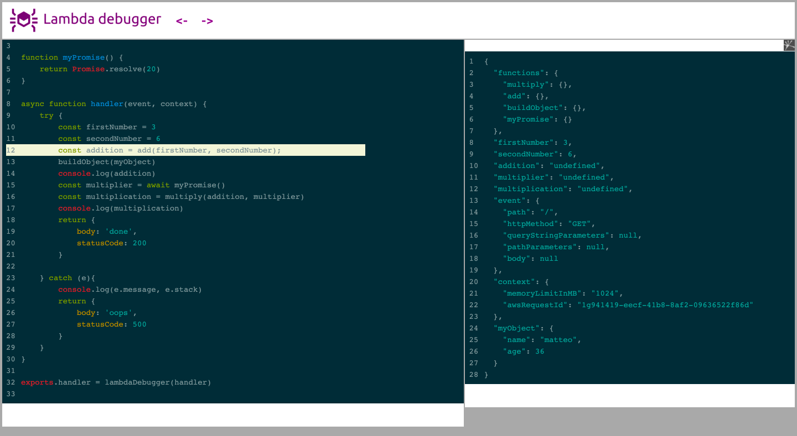

**Time travel offline debugging** for your Nodejs Lambda function.

Lambda debugger records all your function 
execution, so you can replay it at a later time.
Stop scattering your code with `console.log`.



### Example
Download this html file and open it with chrome: [debugger.html](docs/index.html)

## Installation

```bash
npm install lambda-debugger --save
```

## Usage

Just require this module inside your handler

```js
const lambdaDebugger = require("lambda-debugger");

exports.handler = lambdaDebugger((event, context,callback) => {
    callback(null, "Hello Lambda Debugger!");
});
```


## Roadmap

- Support source maps for javascript

---

### Currently under development
